# Identity Lifecycle Management (JML) with Microsoft Entra ID

A hands-on lab implementing the full **Joiner-Mover-Leaver** identity lifecycle in Microsoft Entra ID, using dynamic group membership and native Lifecycle Workflows — no code, no manual access reviews.

## Why this lab

In a real organization, identity management is a lifecycle: people join, change roles, and leave, and access has to follow them automatically. This lab builds that lifecycle end to end and documents the reasoning behind each design decision, not just the clicks.

## Tech stack

- Microsoft Entra ID (Azure AD)
- Microsoft Entra ID Governance (Lifecycle Workflows, Dynamic Groups)

## Phase 1 — Design

Before touching the portal, I defined the scenario on paper. In a real environment, skipping this step is how you end up with group sprawl and rules nobody can explain later.

### The fictional company: Tech Solutions

A small technological company with three departments, enough to demonstrate dynamic rules without overengineering the lab.

| Department | Sample Role          | Location |
| ---------- | -------------------- | -------- |
| IT         | Support Engineer     | PE       |
| Sales      | Sales Representative | PE       |
| HR         | HR Coordinator       | PE       |

### Attributes used

These are the attributes that drive both the dynamic group rules and the lifecycle workflows later on:

| Attribute       | Purpose                                                                                                                           |
| --------------- | --------------------------------------------------------------------------------------------------------------------------------- |
| `department`    | Core attribute for dynamic group membership and for simulating a **Mover** (changing this value triggers automatic re-evaluation) |
| `jobTitle`      | Enables finer-grained rules later (e.g. distinguishing managers from analysts within the same department)                         |
| `usageLocation` | Required by Entra ID before a license can be assigned to a user                                                                   |
| `employeeType`  | Distinguishes employees from contractors; sets up future workflows that treat each type differently                               |

### Naming conventions

- **Users:** `firstname.lastname@domain.onmicrosoft.com`
- **Groups:** `SG-<Department>-Users` (e.g. `SG-IT-Users`); the `SG` (Security Group) prefix follows common enterprise convention, making the group's purpose identifiable at a glance.

### Test identities

| User        | Department | Job Title            | Location | Role in the lab                                 |
| ----------- | ---------- | -------------------- | -------- | ----------------------------------------------- |
| Ana Torres  | IT         | Support Engineer     | PE       | Joiner → later becomes the Mover                |
| Carlos Ruiz | Sales      | Sales Representative | PE       | Stable member of the Sales group (control case) |
| Lucía Vega  | HR         | HR Coordinator       | PE       | Leaver at the end of the lab                    |

Reusing the same identities across phases (instead of creating a new user per scenario) keeps the lab closer to how a real tenant evolves, the same person moves through the organization rather than disappearing and reappearing.

### Dynamic group rule (design)

One rule per department, evaluated automatically by Entra ID whenever a user's `department` attribute changes:

```
(user.department -eq "IT")
```

Three groups in total: `SG-IT-Users`, `SG-Sales-Users`, `SG-HR-Users`.

---

## Phase 2 — Provisioning test users

With the design in place, the next step was creating the three test identities, deliberately using two different methods to show both ends of how identity administration actually happens in a real tenant: one-off changes through the portal, and repeatable work through a script.

### Ana Torres — created manually (Azure portal)

Created through **Entra ID > Users > New user**, with `department`, `jobTitle`, `usageLocation`, and `employeeType` set under Job info. Ana is the identity that later goes through every stage of the lifecycle: created as a Joiner here, changed to Sales as the Mover in Phase 5, and available as a Leaver candidate in Phase 6.

The manual path matters because it's the fastest way to inspect every field Entra exposes on a user object before scripting against it.

### Carlos Ruiz & Lucia Vega — created via Microsoft Graph PowerShell

Provisioning more than one or two users by hand doesn't scale, and it's not how it's done in production. [`scripts/create-users.ps1`](scripts/create-users.ps1) provisions both users through the Microsoft Graph PowerShell SDK, setting the same attributes as the manual path so both methods produce consistent objects.

```powershell
Install-Module Microsoft.Graph -Scope CurrentUser
Connect-MgGraph -Scopes "User.ReadWrite.All"
.\scripts\create-users.ps1
```

**Note:** the script generates temporary passwords using a custom cross-platform function rather than `System.Web.Security.Membership`, which is Windows/.NET Framework-only and unavailable in PowerShell 7, the version most current setups run.

### Result

| User        | Department | Job Title            | Location | Method                     |
| ----------- | ---------- | -------------------- | -------- | -------------------------- |
| Ana Torres  | IT         | Support Engineer     | PE       | Manual (portal)            |
| Carlos Ruiz | Sales      | Sales Representative | PE       | Scripted (Microsoft Graph) |
| Lucía Vega  | HR         | HR Coordinator       | PE       | Scripted (Microsoft Graph) |

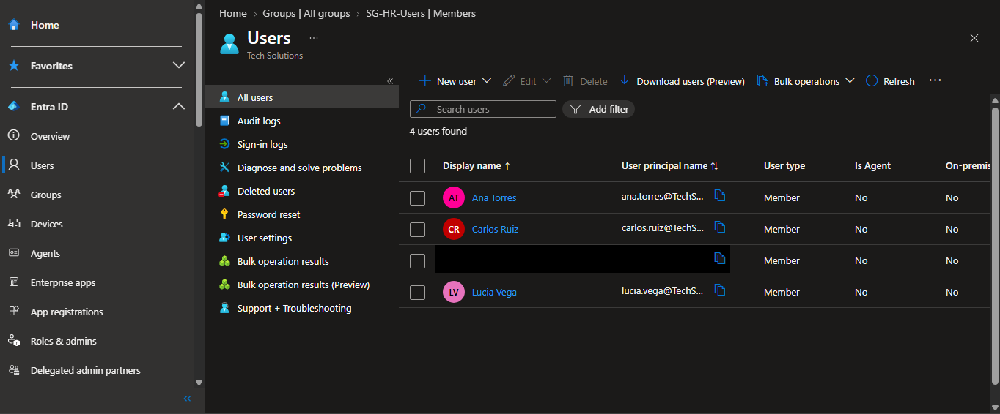

## Phase 3 — Dynamic Groups

With the test identities in place, the next step was letting Entra ID assign group membership automatically instead of managing it by hand, the core mechanic that makes the rest of the lifecycle (and the upcoming Mover simulation) work without manual intervention.

### Groups created

Three Security groups, each with **Membership type** set to **Dynamic User** instead of the default **Assigned**:

| Group            | Dynamic membership rule         |
| ---------------- | ------------------------------- |
| `SG-IT-Users`    | `(user.department -eq "IT")`    |
| `SG-Sales-Users` | `(user.department -eq "Sales")` |
| `SG-HR-Users`    | `(user.department -eq "HR")`    |

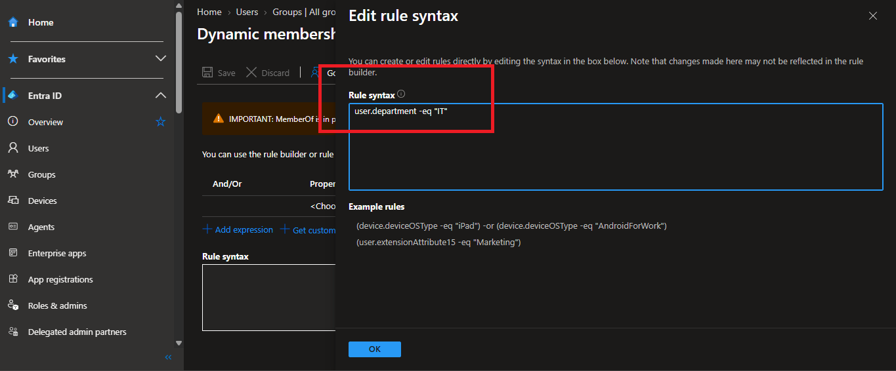

Each rule reads directly off the `department` attribute set during provisioning in Phase 2 — no user was ever manually added to a group.

### Verification

| Group          | Member      | Status            |
| -------------- | ----------- | ----------------- |
| SG-IT-Users    | Ana Torres  | ✅ Auto-evaluated |
| SG-Sales-Users | Carlos Ruiz | ✅ Auto-evaluated |
| SG-HR-Users    | Lucía Vega  | ✅ Auto-evaluated |

**Note:** Dynamic Group evaluation isn't instant, after creating a rule or changing a user's attribute, membership can take a few minutes to update as Entra ID re-processes the rule in the background. This delay is expected, and matters later in Phase 5 when a department change is used to simulate a Mover.

**License requirement:** Dynamic Groups require an Entra ID P1/P2 license on the tenant, already covered by the Entra ID Governance trial activated for the Lifecycle Workflows used in the next phase.

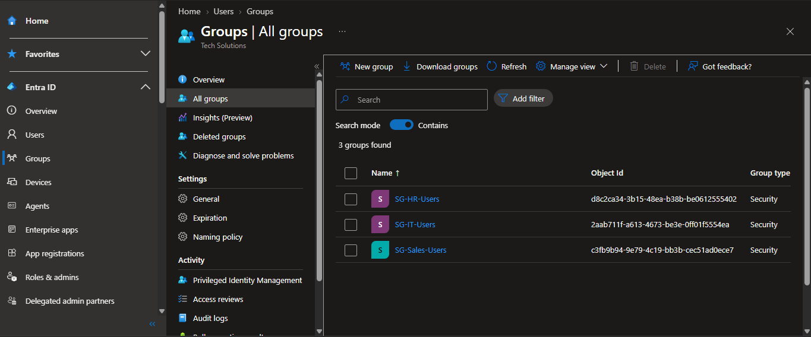

## Phase 4 — Lifecycle Workflows: Joiner

This is where the lifecycle stops being static attributes and becomes an actual automated process: a native Entra ID workflow that runs a sequence of onboarding tasks without any custom code.

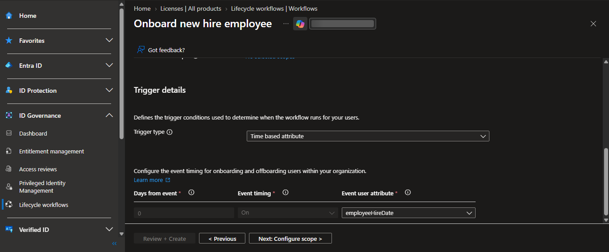

### Workflow configuration

- **Template:** Onboard new hire employee (built-in)
- **Trigger type:** Employee hire date
- **Scope:** All users in the tenant (kept broad for lab simplicity)
- **Tasks included:** Send welcome email, generate Temporary Access Pass (TAP), add user to groups

  Here you can include tasks necesary for your onboarding process when hiring a new employee.

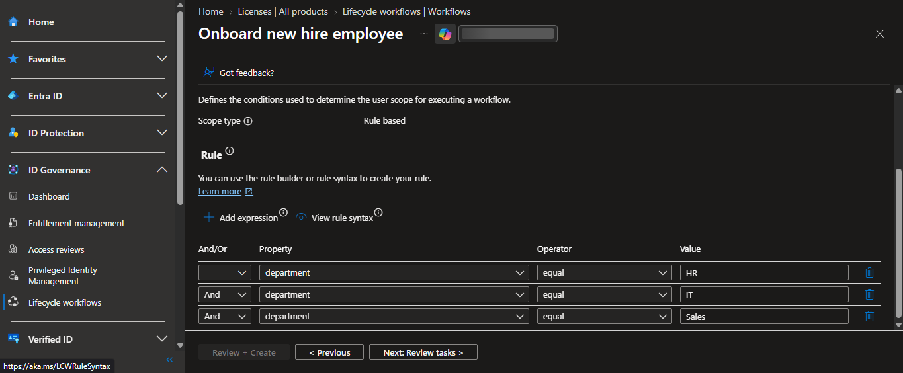

### Prerequisite: licensing

Lifecycle Workflows require the **Microsoft Entra ID Governance** license specifically, having Entra ID P2 alone is not enough, since Governance is a separate SKU. It also has to be assigned to the **administrator's account** configuring the workflow, not only to the test users; the Lifecycle Workflows menu stays locked otherwise, even with the trial active at the tenant level.

### Test run

Rather than waiting for the real hire-date trigger, the workflow was tested on demand against Ana Torres using **Run on demand**, which requires `employeeHireDate` to be set on the user for the trigger's scope check to pass.

| Task               | Result       |
| ------------------ | ------------ |
| Send welcome email | ✅ Completed |
| Generate TAP       | ✅ Completed |
| Add user to groups | ✅ Completed |

All tasks completed successfully, confirmed in **Workflow > Run history**.

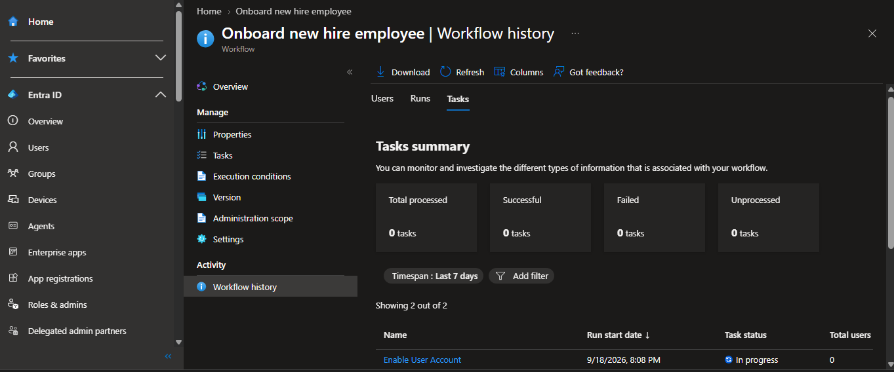

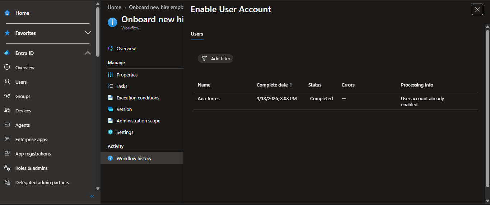

## Phase 5 — Simulating a Mover

This phase is the payoff of the whole design: proving that access follows the person automatically when their role changes, with zero manual group management.

### The change

Ana Torres's `department` attribute was changed from `IT` to `Sales`, the same kind of update that would happen in an HR system when an employee transfers teams.

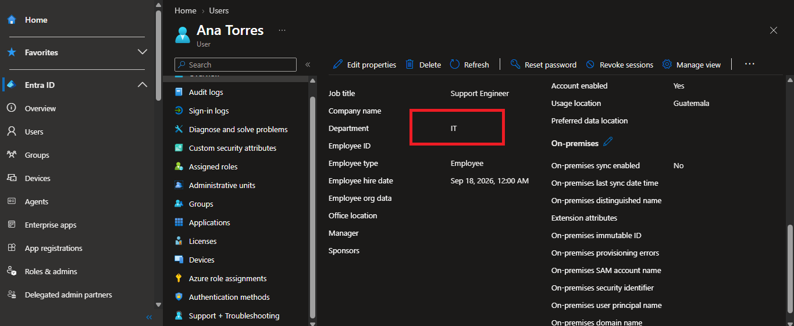

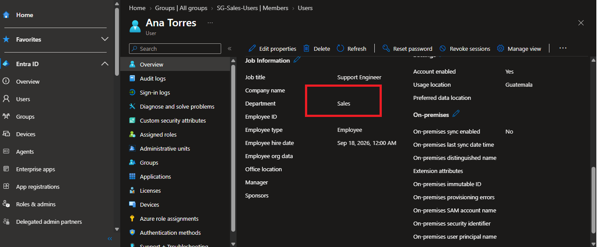

### Result

| Group          | Before        | After              |
| -------------- | ------------- | ------------------ |
| SG-IT-Users    | Ana Torres ✅ | Ana Torres removed |
| SG-Sales-Users | —             | Ana Torres ✅      |

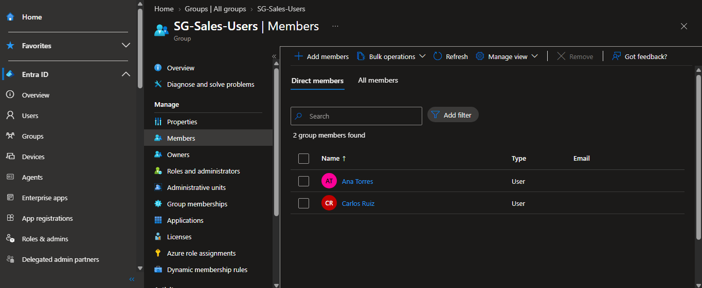

No one touched either group directly. Changing a single attribute was enough for the Dynamic Group rules from Phase 3 to re-evaluate Ana's membership on their own, she was dropped from `SG-IT-Users` and picked up by `SG-Sales-Users` automatically, within a few minutes of the attribute change propagating.

This is the core argument for dynamic, attribute-driven group membership over manually assigned groups: a Mover event requires a single HR-side update, not a checklist of group memberships to fix by hand.

You can even create a Workflow for a mover transition and include tasks related to this event.

## Phase 6 — Leaver

The final stage of the lifecycle: closing an identity's access completely and automatically when they leave the organization.

### Workflow configuration

- **Template:** Real-time employee termination (built-in)
- **Trigger type:** Employee last day of work, based on `employeeLeaveDateTime`
- **Scope:** All users in the tenant
- **Tasks included:** Disable user account, remove user from all groups, revoke all sessions

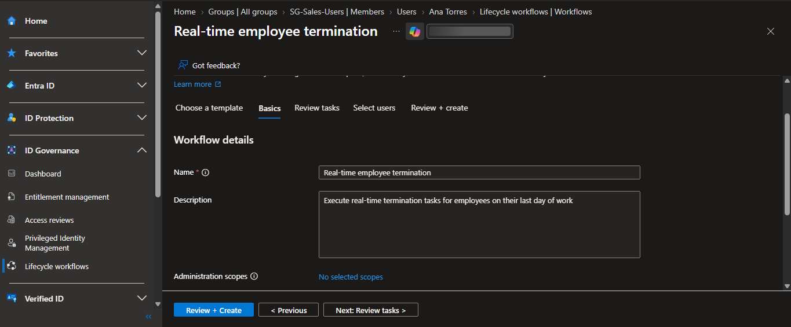

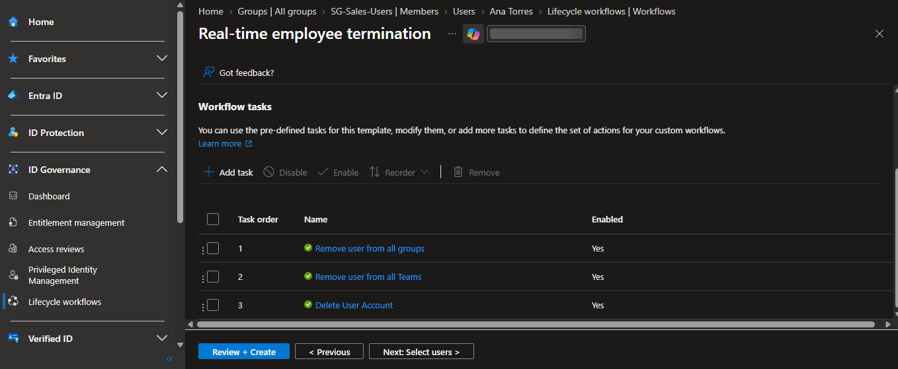

### Setting the trigger attribute

Unlike `employeeHireDate`, the `employeeLeaveDateTime` attribute is **not exposed in the Entra portal UI**, it can only be set through Microsoft Graph, and requires the `User-LifeCycleInfo.ReadWrite.All` scope plus the Global Administrator role for delegated scenarios, since it marks an employee's departure:

```powershell
Connect-MgGraph -Scopes "User-LifeCycleInfo.ReadWrite.All"

Update-MgUser -UserId "lucia.vega@domain.onmicrosoft.com" `
    -EmployeeLeaveDateTime (Get-Date).AddDays(-1)
```

### Why "remove from groups" works here but "add to groups" didn't in Phase 4

This is the other half of the asymmetry first seen in Phase 4: Entra ID allows a workflow task to **remove** a user from a Dynamic Group, because removal is just the natural outcome of the user no longer meeting the rule (or the account being disabled). It only blocks **adding** a user to a Dynamic Group, since that would mean forcing membership the rule engine doesn't grant on its own.

### Test run

Tested on demand against Lucía Vega. Result, confirmed in Run history:

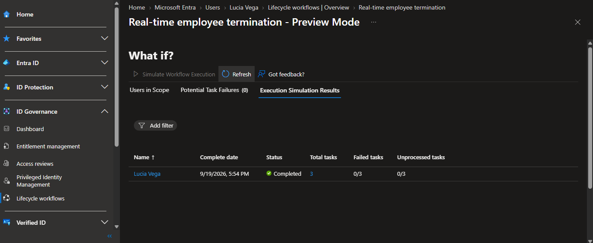

| Task                        | Result       |
| --------------------------- | ------------ |
| Disable user account        | ✅ Completed |
| Remove user from all groups | ✅ Completed |
| Revoke all sessions         | ✅ Completed |

Lucía's account showed `Account enabled = No`, and she no longer appeared as a member of `SG-HR-Users`, closing the loop on the full Joiner → Mover → Leaver cycle.

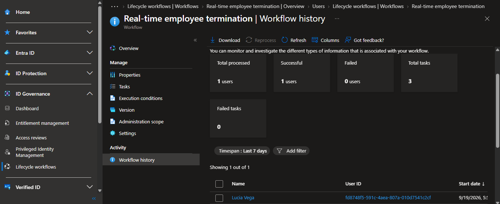

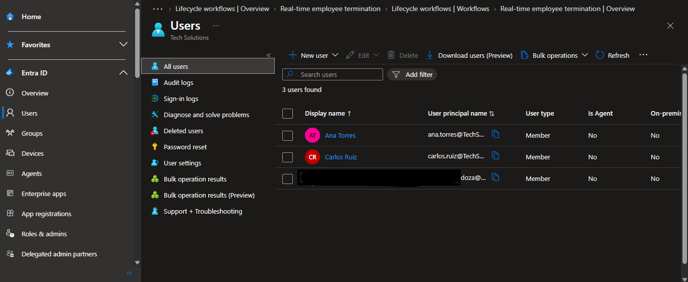

## Key takeaways

- **Identity lifecycle is a system, not a checklist.** Creating a user is the easy part; the real IAM skill is designing how department, hire date, and leave date attributes drive group membership and automated tasks without manual intervention at any stage.
- **Dynamic Groups and Lifecycle Workflows are complementary, not redundant.** Dynamic Groups own attribute-based access; workflows own everything an attribute rule can't do, like sending emails, generating access passes, or disabling accounts. Designing them to overlap (as attempted in Phase 4) surfaces a real platform constraint, not a mistake.
- **A Dynamic Group can lose a member through automation but can't gain one that way.** Membership can always be _removed_ by a workflow task (Phase 6) but never _added_ (Phase 4), because the rule engine, not the workflow is the only thing allowed to grant membership.
- **Licensing in Entra ID Governance has sharp edges worth knowing before an interview.** Entra ID P2 does not include Lifecycle Workflows; that requires the separate Entra ID Governance SKU, and it must be assigned to the administrator configuring the workflow, not just the test users.
- **Some lifecycle attributes only exist in the Graph API, not the portal.** `employeeLeaveDateTime` has no UI field and requires elevated permissions to set — a deliberate friction point given what it triggers.
- **One attribute change cascades correctly across the whole system.** Changing Ana's `department` in Phase 5 was the only action needed to move her between groups — proof that the design correctly separates "who someone is" (HR data) from "what they can access" (computed from that data).
