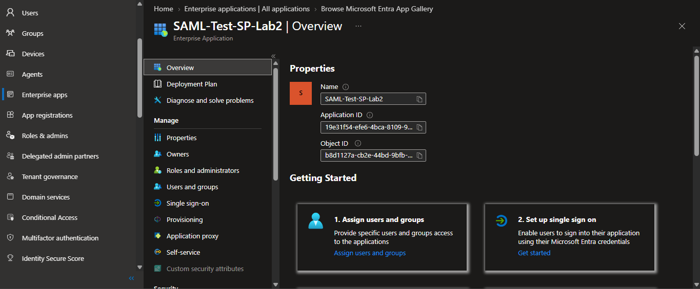
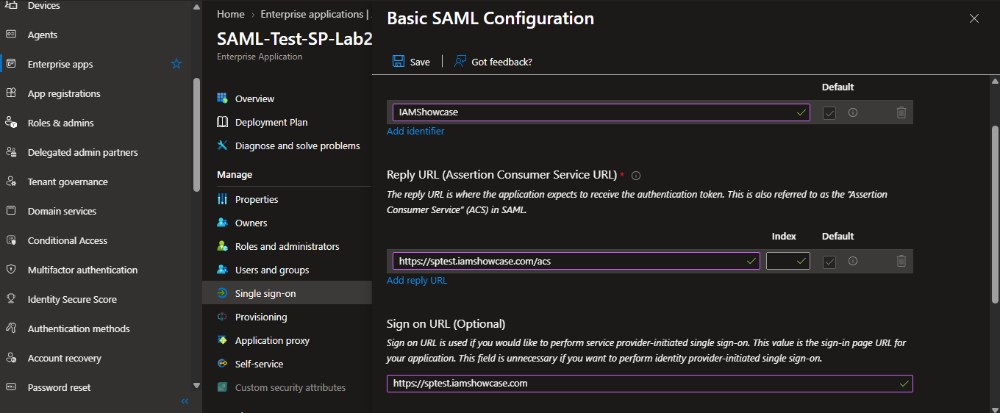
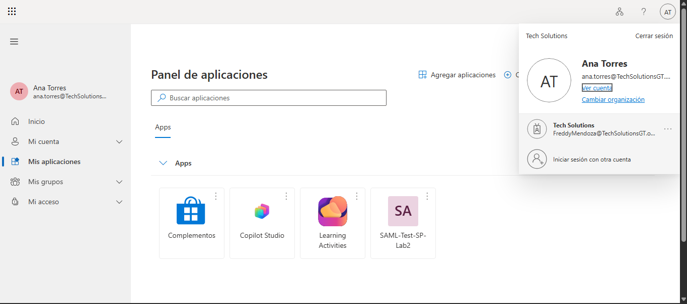
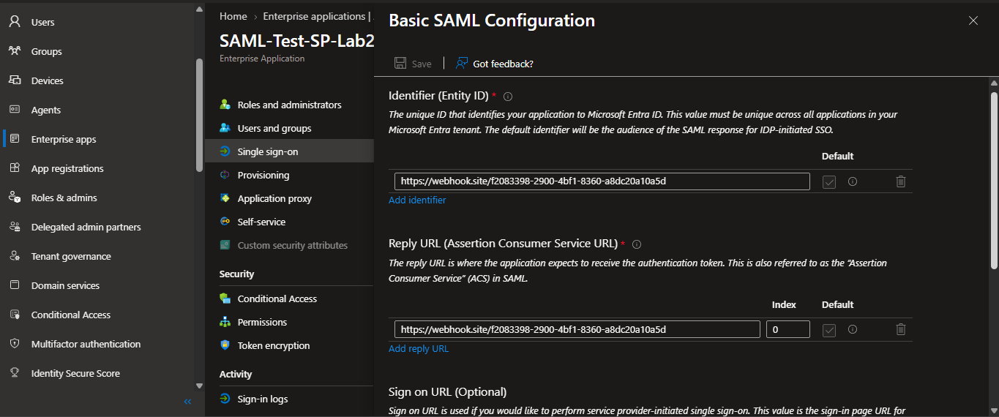
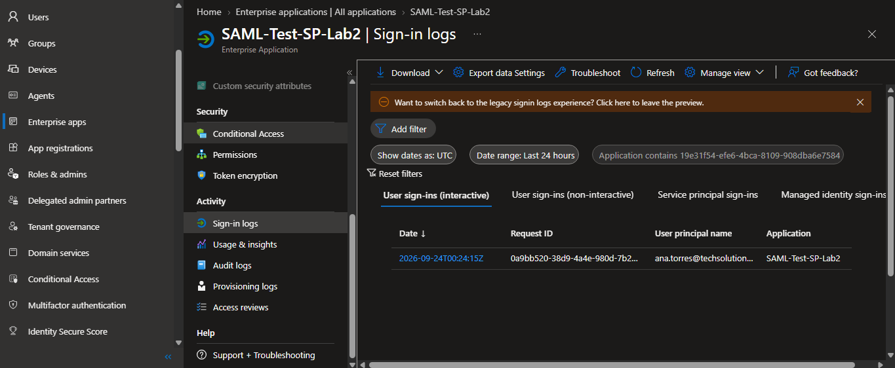

# SSO and Federation with SAML

A hands-on lab configuring real SAML 2.0 federation between Microsoft Entra ID (as Identity Provider) and a test Service Provider, capturing and analyzing the actual protocol exchange, not just enabling a toggle in a portal.

## Why this lab

## Tech stack

- Microsoft Entra ID (Azure AD) — SAML Identity Provider
- Non-gallery Enterprise Application — SAML Service Provider (test SP)
- SAML-tracer (browser extension) — protocol capture

---

## Phase 1 — Design

Before touching the portal, I defined what the federation needed to prove, not just what it needed to work.

### The scenario

Reusing the same fictional company from Lab 1 — **Tech Solutions**, to keep the portfolio's identities consistent across labs. This time Entra ID plays Identity Provider (IdP) for a Service Provider (SP) that trusts it for authentication.



### Claims to send

| Claim        | Source attribute                   | Purpose                                                                                                            |
| ------------ | ---------------------------------- | ------------------------------------------------------------------------------------------------------------------ |
| NameID       | `user.userprincipalname` (default) | Primary subject identifier the SP uses to match the user                                                           |
| `department` | `user.department`                  | Custom claim — demonstrates attribute mapping beyond the defaults, the part most "SSO in 5 minutes" tutorials skip |

Test user: Ana Torres, reused from Lab 1, currently in Sales after the Mover simulation, keeping identity continuity across the portfolio.

---

## Phase 2 — Configuring Entra ID as SAML IdP

### Enterprise Application registration

Created through **Enterprise Applications > New application > Non-gallery application**, named `SAML-Test-SP-Lab2`.

### Basic SAML Configuration

| Field                                  | Value                                |
| -------------------------------------- | ------------------------------------ |
| Identifier (Entity ID)                 | `IAMShowcase`                        |
| Reply URL (Assertion Consumer Service) | `https://sptest.iamshowcase.com/acs` |
| Sign on URL                            | `https://sptest.iamshowcase.com`     |

**Note on SP choice:** the lab originally targeted samltest.id, which turned out to be a parked/expired domain during setup, then sptest.iamshowcase.com, which accepted the flow but returned no inspectable output, a reminder that free test infrastructure isn't guaranteed to stay up or behave predictably. Settled on **webhook.site** as the Reply URL: not a SAML implementation at all, just a raw HTTP request inspector, which turned out to be the more reliable choice precisely because it doesn't try to validate or process the Assertion, it just shows exactly what Entra sent, unfiltered.

### Claims configuration

| Claim        | Value                    | Notes                                   |
| ------------ | ------------------------ | --------------------------------------- |
| NameID       | `user.userprincipalname` | Default, unchanged                      |
| `department` | `user.department`        | Added manually — not present by default |

### IdP metadata and signing certificate

- Federation Metadata XML: [`docs/captures/idp-metadata.xml`]
- Signing certificate (Base64): [`docs/captures/idp-cert.cer`]



---

## Phase 3 — Capturing and analyzing the SAML flow

With the IdP side configured, the next step was watching the actual protocol exchange instead of trusting that "Test this application" worked because the portal said so.

### A note on flow type: IdP-initiated, not SP-initiated

Using Entra's **"Test sign in"** button triggers an **IdP-initiated** flow: Entra generates and pushes the signed Assertion directly, without the SP ever sending an AuthnRequest first. That means there is no AuthnRequest to capture here, the exchange starts directly with the Response/Assertion below. (Contrast with SP-initiated: the SP redirects the user to the IdP with an AuthnRequest first. The `Sign on URL` field is what tells Entra whether to expect that, see the Troubleshooting section below for what happens when it's set incorrectly.)

### SAML Response / Assertion (IdP → SP)



Captured via [webhook.site](https://webhook.site), used as the ACS endpoint so the raw POST body — including the Base64-encoded `SAMLResponse` — could be inspected directly, decoded, and analyzed line by line.

```xml
<samlp:Response ID="_ce782156-..." Version="2.0"
    IssueInstant="2026-09-24T00:24:15.913Z"
    Destination="https://webhook.site/<endpoint-id>">
  <Issuer>https://sts.windows.net/<tenant-id>/</Issuer>
  <samlp:Status>
    <samlp:StatusCode Value="urn:oasis:names:tc:SAML:2.0:status:Success"/>
  </samlp:Status>
  <Assertion ID="_0a9bb520-...">
    <Signature>
      <SignatureMethod Algorithm=".../xmldsig-more#rsa-sha256"/>
      <!-- X509Certificate matches the one downloaded in Phase 2 -->
    </Signature>
    <Subject>
      <NameID Format="...emailAddress">ana.torres@<tenant-domain>.onmicrosoft.com</NameID>
    </Subject>
    <Conditions NotBefore="2026-09-24T00:19:15.840Z"
                NotOnOrAfter="2026-09-24T01:24:15.840Z">
      <AudienceRestriction>
        <Audience>https://webhook.site/<endpoint-id></Audience>
      </AudienceRestriction>
    </Conditions>
    <AttributeStatement>
      <Attribute Name="department">
        <AttributeValue>Sales</AttributeValue>
      </Attribute>
      <!-- plus tenantid, objectidentifier, displayname, identityprovider claims -->
    </AttributeStatement>
  </Assertion>
</samlp:Response>
```

| Field                                 | Value                                                                   | What it means                                                                                                                            |
| ------------------------------------- | ----------------------------------------------------------------------- | ---------------------------------------------------------------------------------------------------------------------------------------- |
| NameID                                | `ana.torres@<tenant-domain>.onmicrosoft.com` (emailAddress format)      | Subject identifier the SP uses to establish the session — matches Ana's UPN from the Lab 1 identity                                      |
| Conditions (NotBefore / NotOnOrAfter) | `00:19:15.840Z` → `01:24:15.840Z` (~1 hour window)                      | Bounds the assertion's validity — a captured assertion replayed after this window is rejected outright, regardless of signature validity |
| Signature                             | `rsa-sha256`, exclusive canonicalization, enveloped-signature transform | Signed with Entra's federation certificate — the same one downloaded in Phase 2, confirming the trust chain                              |
| AttributeStatement — `department`     | `Sales`                                                                 | The custom claim configured in Phase 2 arrived correctly, reflecting Ana's post-Mover department from Lab 1                              |
| AttributeStatement — other claims     | tenantid, objectidentifier, displayname, identityprovider               | Sent automatically by Entra as part of the default claim set, independent of the custom claim added                                      |

---

## Phase 4 — Troubleshooting scenario

This wasn't a scenario staged for the README, it's the actual blocker hit while trying to capture the first flow, which makes it a more honest demonstration of debugging than a deliberately-broken demo would be.



### The problem

With `Sign on URL` set to the SP's URL and `Identifier`/`Reply URL` correctly pointing to the test SP, "Test sign in" as Ana produced only a plain **GET** request to the SP's root — no SAMLResponse, no POST, nothing to analyze.

### Diagnosis

Captured with SAML-tracer and cross-checked in webhook.site: the request was a bare navigation, not a SAML message. That ruled out a claims or certificate problem — the failure was happening before Entra even attempted to build an Assertion.

### Root cause

**`Sign on URL` tells Entra which flow to expect.** When it's populated, Entra assumes **SP-initiated SSO**: it expects the _Service Provider_ to send the user to Entra with an AuthnRequest first, and simply redirects the user there to let that happen. Since the test SP (a webhook, not a real application) never sends an AuthnRequest, the flow just... stops, with nothing more than a GET.

### Resolution

Cleared `Sign on URL`, leaving it blank. With no Sign on URL configured, Entra defaults to **IdP-initiated SSO** on "Test sign in": it builds and POSTs the signed Assertion directly to the Reply URL, without expecting anything from the SP first. The very next test produced the full SAMLResponse captured and analyzed in Phase 3.

### Why this matters beyond this lab

`Sign on URL` isn't just a "nice to have" field, it's the switch between two fundamentally different trust flows. Getting this wrong in a real enterprise deployment reads as "SSO configured but users can't log in" and is one of the more common first-line support tickets in SSO/IAM roles, which is exactly why documenting it here (with a genuine capture showing the difference) demonstrates the skill better than a clean walkthrough would.



---

## Key takeaways

- **A working SSO toggle and a working SSO integration are not the same claim.** Enabling SAML in the portal takes a minute; being able to read the AuthnRequest and Assertion that toggle produces is the actual skill being tested in an interview.
- **`Sign on URL` silently changes the entire trust flow.** Leaving it populated makes Entra assume SP-initiated SSO and wait for an AuthnRequest that never comes; clearing it switches to IdP-initiated SSO, which is what "Test sign in" actually needs. This single field was the difference between a bare GET and a full signed Assertion.
- **Signature and Conditions aren't decorative XML — they're the entire trust and replay-protection mechanism.** The Assertion's 1-hour validity window (`NotBefore`/`NotOnOrAfter`) means a captured Assertion is worthless outside that window even with a perfectly valid signature, and the signature itself is what lets the SP trust the Assertion came from Entra without a prior handshake.
- **A generic HTTP inspector can be a better debugging tool than a "real" test SP.** Using webhook.site instead of a full SAML SP implementation removed a layer of behavior I didn't control, making it possible to see exactly what Entra sent without guessing whether a third-party SP's validation logic was the source of a failure.
