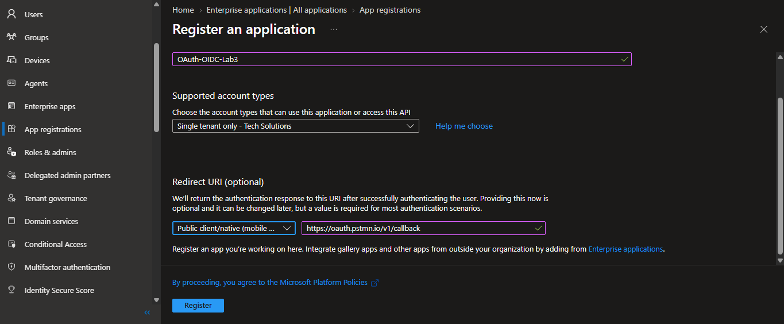
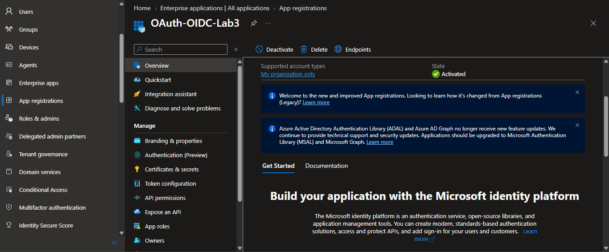
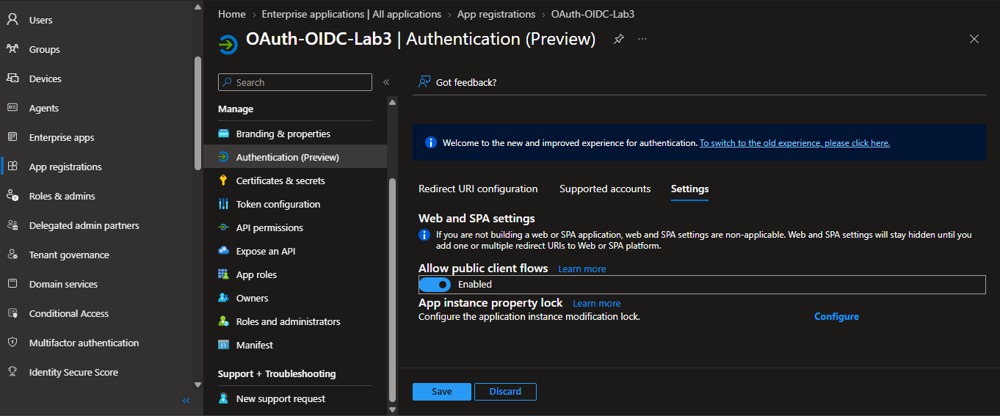

# OAuth 2.0 and OIDC with Microsoft Entra ID

A hands-on lab implementing the Authorization Code Flow with PKCE against a real Entra ID App Registration, tracing the exchange manually enough to explain, claim by claim, why an ID Token and an Access Token are not the same thing.

## Why this lab

OAuth 2.0 is an **authorization** protocol (what can this token holder do), and OpenID Connect is an **authentication** layer built on top of it (who is this). This lab runs the full Authorization Code + PKCE flow by hand, decodes both tokens side by side, and adds a Conditional Access policy to show the protocol operating inside an actual enterprise control plane, not just a toy client.

## Tech stack

- Microsoft Entra ID — App Registration (OAuth 2.0 / OIDC provider)
- Postman — interactive Authorization Code + PKCE flow
- Python (`requests`, `PyJWT`) — manual token exchange and decoding
- Microsoft Entra ID — Conditional Access

## Phase 1 — Design

Before registering anything, deciding what the flow needs to prove mattered more than getting a token as fast as possible.

### The scenario

Continuing with **Tech Solutions** from Labs 1 and 2.

**Test user:** Carlos Ruiz — Sales Representative, stable since Lab 1 (never moved or removed), which keeps this lab independent from the Joiner/Mover/Leaver history on Ana and Lucía.

### Scopes requested

| Scope              | Purpose                                                                                         |
| ------------------ | ----------------------------------------------------------------------------------------------- |
| `openid`           | Triggers OIDC — without it, Entra returns only an OAuth Access Token, no ID Token at all        |
| `profile`, `email` | Adds basic identity claims (name, email) to the ID Token                                        |
| `User.Read`        | Microsoft Graph delegated permission — gives the Access Token something real to be used against |

### ID Token vs Access Token — the distinction this lab exists to prove

|                                | ID Token                        | Access Token                            |
| ------------------------------ | ------------------------------- | --------------------------------------- |
| Protocol                       | OpenID Connect                  | OAuth 2.0                               |
| Answers                        | "Who is this user?"             | "What can this bearer do?"              |
| Audience                       | The client application itself   | The resource API (e.g. Microsoft Graph) |
| Consumed by                    | The app, to establish a session | The API, to authorize the request       |
| Should ever be sent to an API? | No                              | Yes, as a Bearer token                  |

---

## Phase 2 — App Registration

### Registration

- **App registrations → New registration**
- Name: `OAuth-OIDC-Lab3`
- Supported account types: single tenant
- Redirect URI: `https://oauth.pstmn.io/v1/callback`





### Authentication settings

- **Allow public client flows:** enabled, required for PKCE without a client secret, since a public client (like a Postman collection or a SPA) can't safely hold a secret.



### API permissions

| Permission                   | Type                                 |
| ---------------------------- | ------------------------------------ |
| `openid`, `profile`, `email` | Delegated (Microsoft Graph, default) |
| `User.Read`                  | Delegated (Microsoft Graph)          |

### Key identifiers

| Field                   | Value                                                                                          |
| ----------------------- | ---------------------------------------------------------------------------------------------- |
| Application (client) ID | `8bef5cb1-f47a-4556-b0b9-cf63302a8c90`                                                         |
| Directory (tenant) ID   | `834f5cb1-f43a-4826-b0b9-cfafsd548c90`                                                         |
| Authorization endpoint  | `https://login.microsoftonline.com/834f5cb1-f43a-4826-b0b9-cfafsd548c90/oauth2/v2.0/authorize` |
| Token endpoint          | `https://login.microsoftonline.com/834f5cb1-f43a-4826-b0b9-cfafsd548c90/oauth2/v2.0/token`     |

---

## Phase 3 — Running the flow (Authorization Code + PKCE)

### Why PKCE, specifically

Postman is a **public client**: it can't hold a client secret safely, because anyone with access to the collection (or a network trace) could extract it, and once a secret client is impersonated, every distinction the OAuth flow makes between "verified client" and "attacker" collapses. PKCE sidesteps needing a secret at all. Instead, the client generates a random `code_verifier` at the _start_ of the flow, sends only its hash (the `code_challenge`) with the authorization request, and later proves it holds the original `code_verifier` when exchanging the authorization code for tokens. Even if an attacker intercepts the authorization code mid-flow (the actual threat PKCE was designed against, a leaked redirect on a mobile OS, for instance), they can't complete the exchange without the `code_verifier`, which never left the original client.


### The exchange

| Step                        | Value                                                                                                                                                 |
| --------------------------- | ----------------------------------------------------------------------------------------------------------------------------------------------------- |
| `code_verifier`             | Generated automatically by Postman, a random string, base64url-encoded, not exposed in the UI since it's discarded right after the exchange completes |
| `code_challenge`            | `SHA256(code_verifier)`, base64url-encoded, sent in the initial authorization request                                                                 |
| `code_challenge_method`     | `S256`                                                                                                                                                |
| Authorization Code received | Single-use, redeemed immediately by Postman, not logged here since it's meaningless after redemption                                                  |
| Redirect after auth         | Landed on `https://oauth.pstmn.io/v1/callback` with the `code` query parameter, matching the Redirect URI registered in Phase 2                       |

### Token response

```json
{
  "token_type": "Bearer",
  "scope": "email openid profile User.Read",
  "expires_in": 5018,
  "access_token": "eyJ0eXAiOiJKV1Qi...<truncated>",
  "id_token": "eyJ0eXAiOiJKV1Qi...<truncated>"
}
```

---

## Phase 4 — Token comparison

### ID Token claims

| Claim                         | Value                                                         | What it means                                                                                           |
| ----------------------------- | ------------------------------------------------------------- | ------------------------------------------------------------------------------------------------------- |
| `aud`                         | `8bef5cb1-...` (this app's own Client ID)                     | Confirms the token is meant for THIS app, not any API                                                   |
| `sub`                         | `KetQhOmDoh1p...` (opaque, app-specific identifier)           | Subject identifier for Carlos within this app — different from the `sub` in the Access Token, by design |
| `name` / `preferred_username` | `Carlos Ruiz` / `carlos.ruiz@<tenant-domain>.onmicrosoft.com` | Identity claims — this is what the app uses to know who's logged in                                     |
| `iat` / `exp`                 | issued, expires ~1h 5min later                                | Issued-at and expiry — much shorter-lived than a session cookie would be                                |

### Access Token claims

| Claim   | Value                                                                           | What it means                                                                                                         |
| ------- | ------------------------------------------------------------------------------- | --------------------------------------------------------------------------------------------------------------------- |
| `aud`   | `00000003-0000-0000-c000-000000000000` (Microsoft Graph's fixed application ID) | Confirms this token is meant for the API, not the app itself — a completely different value from the ID Token's `aud` |
| `scp`   | `email openid profile User.Read`                                                | The actual permissions granted — this is what Graph checks on each request                                            |
| `appid` | `8bef5cb1-...` (this app's Client ID)                                           | Which app requested this on the user's behalf — same value that appeared as `aud` in the ID Token                     |
| `amr`   | `["pwd", "mfa"]`                                                                | Authentication methods actually used for this sign-in — proof the user authenticated with password + MFA              |

### What this confirms

The `aud` claim alone settles the theoretical distinction from Phase 1 with real evidence: the ID Token's `aud` is this app's own Client ID (`8bef5cb1-...`), while the Access Token's `aud` is `00000003-0000-0000-c000-000000000000`, Microsoft Graph's fixed, well-known application ID, the same across every Entra tenant in the world. They're not just different values; they point to different consumers entirely. If this app sent the ID Token to Microsoft Graph as a Bearer token instead of the Access Token, Graph would reject it outright, the audience simply wouldn't match, regardless of the token being validly signed by the same tenant.

The two tokens also carry deliberately different `sub` values for the same user (`6O92f3GWWpB...` in the Access Token vs `KetQhOmDoh1p...` in the ID Token). Entra generates a separate, opaque subject identifier per audience, so that Microsoft Graph and this app can't correlate Carlos's identity across each other just by comparing `sub` values.

One unplanned but useful finding: the Access Token's `amr` claim already showed `["pwd", "mfa"]` before any Conditional Access policy was configured in Phase 5, meaning MFA was already being enforced tenant-wide by a pre-existing policy (Security Defaults or another CA rule). This became directly relevant once the app-scoped policy below was added.

---

## Phase 5 — Conditional Access

### Policy configuration

- **Entra ID → Protection → Conditional Access → New policy**
- **Name:** `CA-MFA-OAuth-OIDC-Lab3`
- **Users:** Carlos Ruiz (Include → Specific users)
- **Target resources:** `OAuth-OIDC-Lab3` only (Include → Select apps) — never "All cloud apps"
- **Grant control:** Require multifactor authentication

### Result: blocked by Security Defaults

The portal refused to save the policy, showing that **Security Defaults and Conditional Access are mutually exclusive** on this tenant's license tier, Security Defaults already enforces a tenant-wide, non-customizable MFA baseline, and Microsoft doesn't allow layering app-scoped Conditional Access on top of it without first disabling Security Defaults.

This connects directly to the Phase 4 finding: the Access Token's `amr: ["pwd", "mfa"]` claim, observed _before_ attempting this policy, is explained by Security Defaults already enforcing MFA tenant-wide, not by the app-specific policy this phase intended to add.

### What this means in practice

In a real deployment, this is the actual first decision an IAM engineer has to make when introducing Conditional Access: **Security Defaults is an all-or-nothing baseline; Conditional Access is how you get granular, per-app or per-condition control**, but the tenant has to graduate from one to the other deliberately, not layer them. Disabling Security Defaults to enable a single app-scoped policy is a real trade-off (losing the tenant-wide baseline protection in exchange for precision), not just a lab formality, which is exactly why it wasn't done casually here just to force the demo.

---

## Key takeaways

- **OAuth and OIDC solve different problems, and the token types prove it.** The Access Token's `aud` pointed to Microsoft Graph's fixed application ID; the ID Token's `aud` pointed to this app's own Client ID. Same login, same user, two tokens meant for two completely different consumers, that's the whole distinction made concrete instead of theoretical.
- **PKCE exists because public clients can't keep secrets.** A client like Postman (or a mobile app, or a SPA) can't safely embed a client secret, anyone could extract it from the client. PKCE replaces "prove you know the secret" with "prove you're the same party that started this specific flow," using a value (`code_verifier`) that's generated fresh per attempt and never stored anywhere long-lived.
- **Security Defaults and Conditional Access are mutually exclusive — and that's a real design decision, not a lab technicality.** Attempting to scope a custom MFA policy to a single app failed outright because Security Defaults was already enforcing a tenant-wide baseline. Graduating to Conditional Access means deliberately trading that baseline for granular control, not just adding rules on top.
- **A claim you didn't expect to need can end up explaining a claim you already had.** The Access Token's `amr: ["pwd", "mfa"]`, decoded back in Phase 4 before Conditional Access was even attempted, only made full sense once Phase 5 revealed Security Defaults was the actual source of that MFA enforcement.
